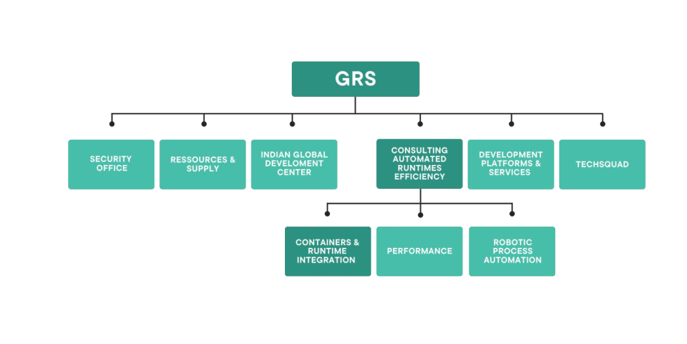

# Suivi du stage d'Adrien CAUQUIL

## Lundi 19 Février 2024

<hr>

### Programme : 
- Découverte / présentation de l'entreprise [WORLDLINE](https://worldline.com/fr-fr/home.html).
- Présentation du département GRS : _Global Resources and Supports_.
- Initiation à la programmation en Java.
- Présentation du service "Bureautique".

<hr>

### Découverte de l'entreprise Worldline


Anciennement filiale d’Atos, Worldline est depuis mai 2019 une entreprise autonome.  
Créée en 2004 et présente dans plus de **50 pays**, leader européen et **4ème** acteur mondial de
référence dans le secteur des paiements et des services transactionnels, Worldline met en
place des services nouvelle génération, permettant à ses clients d’offrir au consommateur
final des solutions innovantes et fluides.  
Cette multinationale est spécialisée dans les services transactionnels, les paiements en ligne, et les terminaux de paiement. Worldline emploie plus
de **20 000** collaborateurs dans le monde entier et a généré un chiffre d'affaires estimé à environ 4.4 milliards d’euros en 2022.   
Ses activités sont regroupées autour de trois grands pôles projets :  
  ▪ **Merchant Services (MS)** : services de paiement et services en ligne pour la distribution
  en général.  
  ▪ **Financial Services (FS)** : services de paiement porteurs, services en ligne financiers et
  vente de licence/intégration des logiciels de paiement de Worldline.  
  ▪ **Mobility & E-Transactional Services (MTS)** : services en ligne transactionnels pour le eticketing, e-mail, e-administration, e-contact et liés aux objets connectés.

<hr>

### Présentation de GRS-CRI (_Global Resources and Support_)

D'autres pôles tel que les resourses humaines, la recherche et développement ou encore _Global Resources and Support_ (GRS) consituent des équipes transverses
aux trois grands pôles (MS, FS et MTS). 



**GRS** est constituée de plusieurs départements dont **Consulting & Automated
Runtimes Efficiency**, qui fournit du support et participe à la résolution de bugs. Ce
département comporte trois équipes : **Containers & Runtime Integration** (CRI), **Robotic
Process Automation** (RPA) et **Performance**. L’équipe Performance propose entre autres des
outils pour tester les performances des applications, notamment des simulateurs de charge
et des outils d’analyse. L’équipe RPA est chargée de l’automatisation de tâches récurrentes
par des robots. L’équipe CRI participe aux tâches suivantes :  
▪ Support technique sur différentes solutions utilisées dans l’entreprise tel qu’Apigee, Docker, JBoss, Quarkus …  
▪ Formations (Quarkus, Docker).  
▪ Organisation d’événements techniques.  
▪ Rédaction de documentations techniques visant à promouvoir et diffuser les meilleures pratiques de développement et d’intégration au sein de Worldline.    

<hr>

### Initiation à la programmation en Java

**Java** est un langage interprété, ce qui signifie qu'il ne peut pas être exécuté directement par le système d'exploitation. 
Pour exécuter un programme _Java_, il faut d'abord le _compiler_.
A travers ce premier projet, Adrien a créé son premier projet Java constitué d'une class Main qui utilise _system.out.printf_ (qui lui a permis d'afficher 
dans la console "Hello and Welcome!").
  
Ensuite, Adrien a pu avoir comment améliorer ce premier programme en utilisant _system.out.println_ (qui permet de revenir à la ligne). Adrien s'est approprié
le programme en le faisant évoluer.
  
Enfin, Adrien a pu voir comment utiliser des arguments lorsqu'il execute son projet afin d'enrichir le message afficher.

Durant cet exercice Adrien a appris : 
- à créer un projet Java
- à compiler son projet Java à l'aide de la commande :
```shell
$ javac .\src\Main.class
```
- à exécuter sur projet (lancer le Main de son projet) à l'aide de la commande:
 ```shell
$ java .\src\Main.java luke
```

<hr>

### Présentation du service de Bureautique
Présentation du service de la Bureautique. Adrien a pu découvrir le cycle de vie de la réception d'un pc en passant par son déploiement jusqu'à sa destruction.
