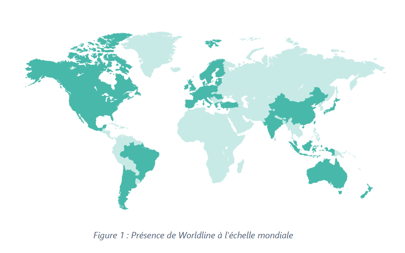

# Suivi du stage d'Adrien CAUQUIL

## Lundi 19 Février 2024

### Programme : 
- Découverte / présentation de l'entreprise
- Présentation de GRS
- Initiation à la programmation en Java
- Présentation sur service "Bureautique"

### Découverte de l'entreprise Worldline

Anciennement filiale d’Atos, Worldline est depuis mai 2019 une entreprise autonome.
Créée en 2004 et présente dans plus de **50 pays**, leader européen et **4ème** acteur mondial de
référence dans le secteur des paiements et des services transactionnels, Worldline met en
place des services nouvelle génération, permettant à ses clients d’offrir au consommateur
final des solutions innovantes et fluides. Cette multinationale est spécialisée dans les services
transactionnels, les paiements en ligne, et les terminaux de paiement. Worldline emploie plus
de **20 000** collaborateurs dans le monde entier et a généré un chiffre d'affaires estimé à
environ 4.4 milliards d’euros en 2022. Ses activités sont regroupées autour de trois grands
axes :  
  ▪ Merchant Services : services de paiement et services en ligne pour la distribution
  en général.  
  ▪ Financial Services : services de paiement porteurs, services en ligne financiers et
  vente de licence/intégration des logiciels de paiement de Worldline.  
  ▪ Mobility & E-Transactional Services : services en ligne transactionnels pour le eticketing, e-mail, e-administration, e-contact et liés aux objets connectés.  